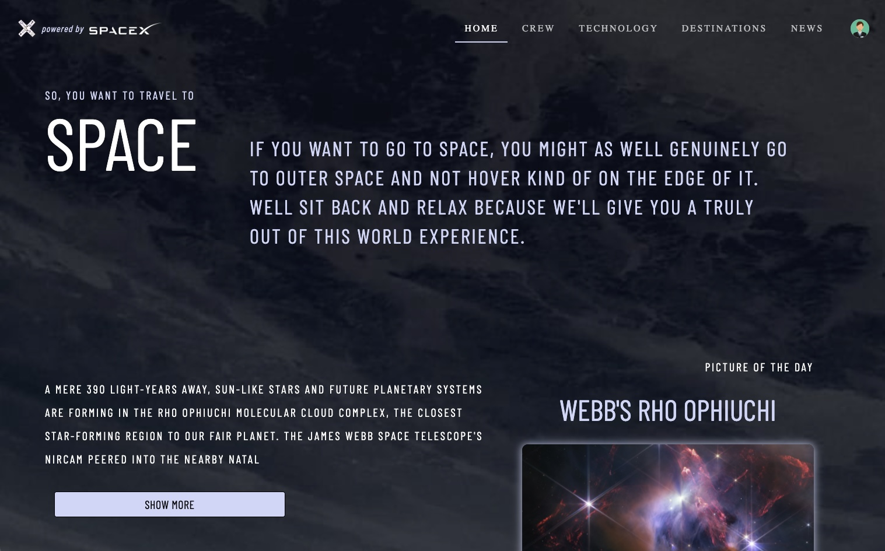
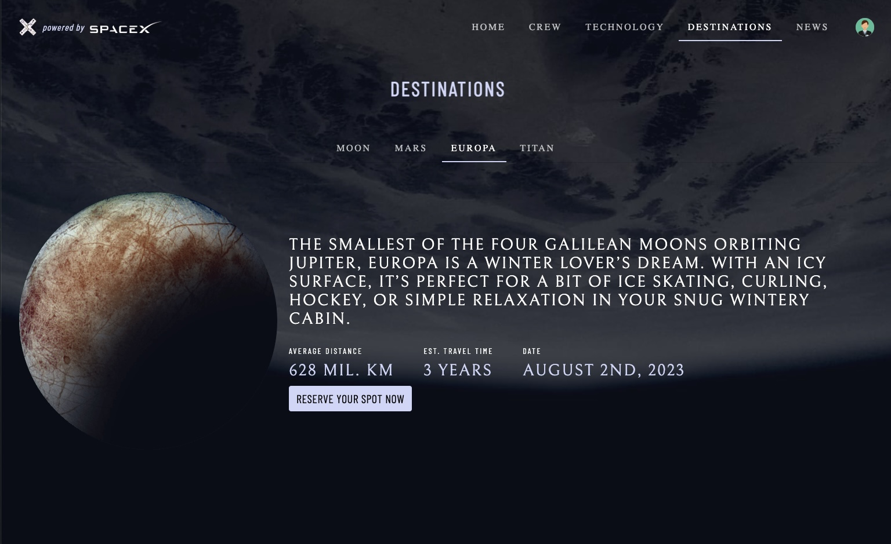
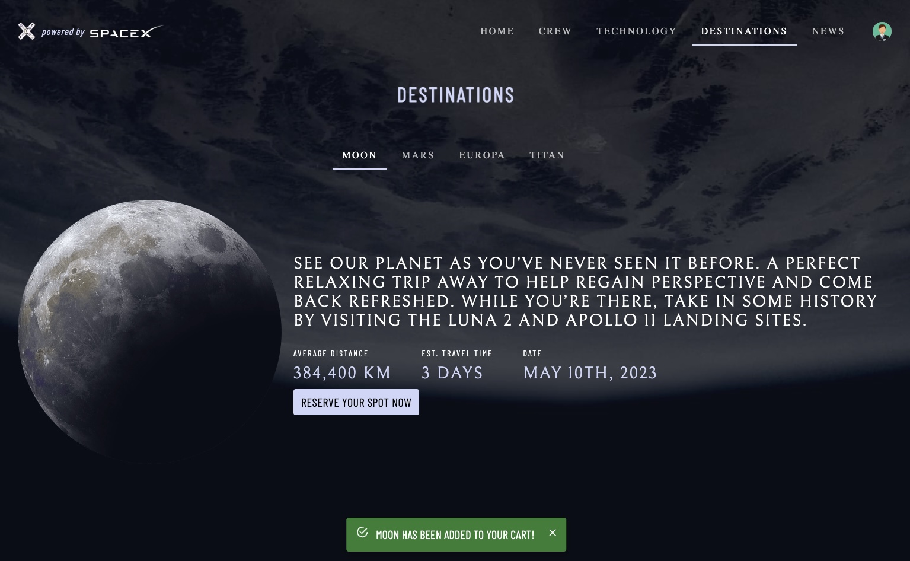
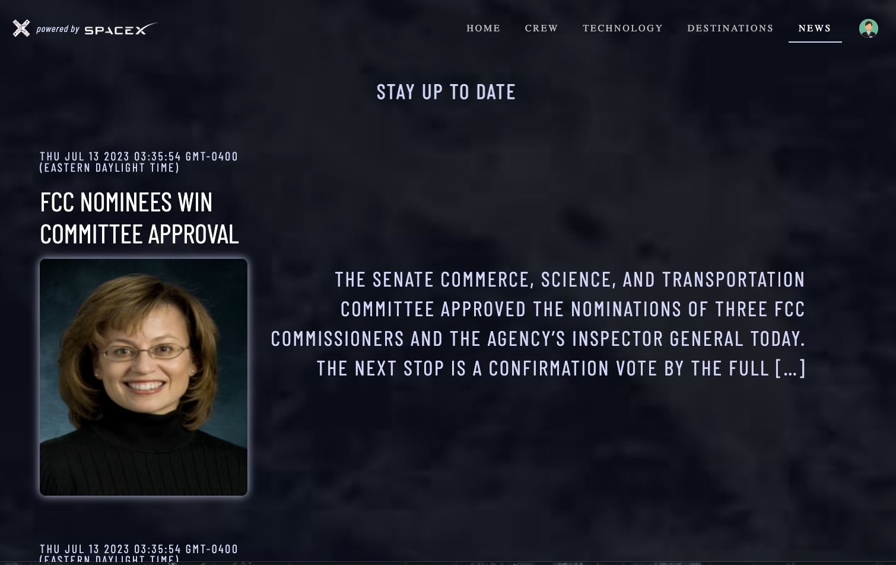
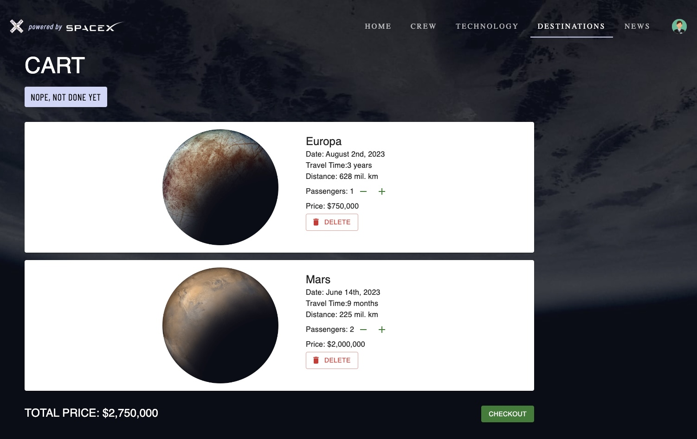
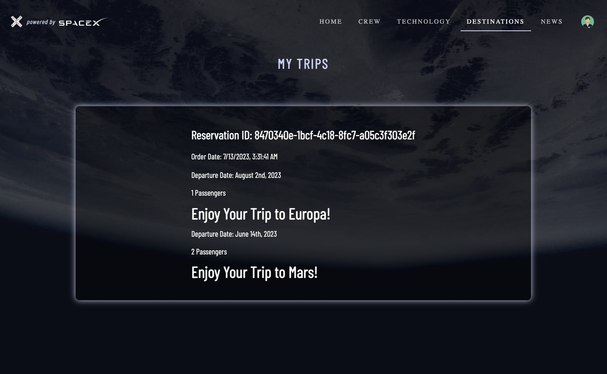

<h1 align="center">E-Commerce Space Travel 🚀</h1>

## 👨‍💻 About The Project

Developed an engaging platform that caters to space enthusiasts, allowing them to plan and book interplanetary journeys.

## 🛠️ Built With

This application was built utilizing a collection of technologies including but not limited to:

* JavaScript
* React
* Redux
* Node.js
* Express
* PostgreSQL
* Sequelize
* JWT Authentication 
* Bootstrap
* Material UI

## 📖 Features

* Real-time Space News: Leverages third-party APIs to provide users with the latest space news and information about technology, crew, and planets. This feature enhances user engagement and makes the platform a one-stop-shop for space enthusiasts.
* Streamlined Reservation System: Includes an efficient reservation system that generates unique IDs upon checkout, making it easy for users to track their planned interplanetary journeys.
* Personalized User Experience: Designed with the user in mind, allowing them to customize their profiles and plan their journeys.
* Engaging User Interface: The platform's user interface is both visually striking and easy to navigate, immersing users in the vastness of space while they plan their journeys.
  
## 📸 Snapshots

---

---

---

---

---

